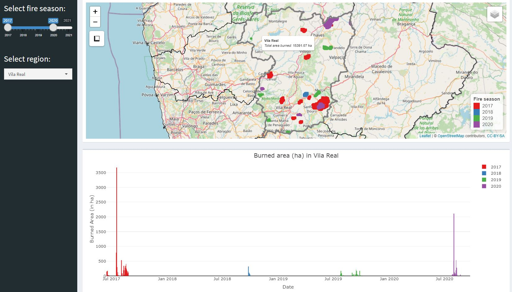

# Visualizing wildfires during fire seasons 2017-2021 in Portugal

This repo interactivley visualizes the burnt areas during the fire seasons 2017-2021 in Portugal in a ```shiny```app.
The burned areas were derived from MODIS MCD64A1 Burned Area product, which was automatically downloaded and processed with ```MODIStsp```.

## Deployment of wildfire dashboard

To deploy the ```shiny``` app directly via GitHub run:
```
runGitHub(repo = "wildfire-analysis-portugal",
          username = "moritzroesch",
          ref = "main",
          subdir = "scripts/wildfire-dashboard")
```  
The app contains a interactive ```leaflet``` map of Portugal with the yearly burned areas.
Additionally, the app contains a linked ```plotly``` bar plot which qunatifies the burned area over time.
The app can be filtered by the yearly fire seasons or by the subdivisions of Portugal.


## Download and processing MODIS burned area product
To redo the automatic downloading and processing of MODIS MCD64A1 Burned Area product clone the repository and run follwing scripts:
1. [MCD64A1_download_preproc](scripts/MCD64A1_download_preproc.R)
* Download vector data for study area
* Using of ```MODIStsp``` package to query five years of fire season (June-September) MCD64A1 product with a predefined [.json setup file](auxiliary/MCD64A1_PRT_setup.json)
    - pre-processing (i.e., reprojecting, cropping, mosaicing) done automatically by ```MODIStsp```
2. [MCD64A1_poly_conversion](scripts/MCD64A1_poly_conversion.R)
* Loading of time series raster stacks and conversion to polygons